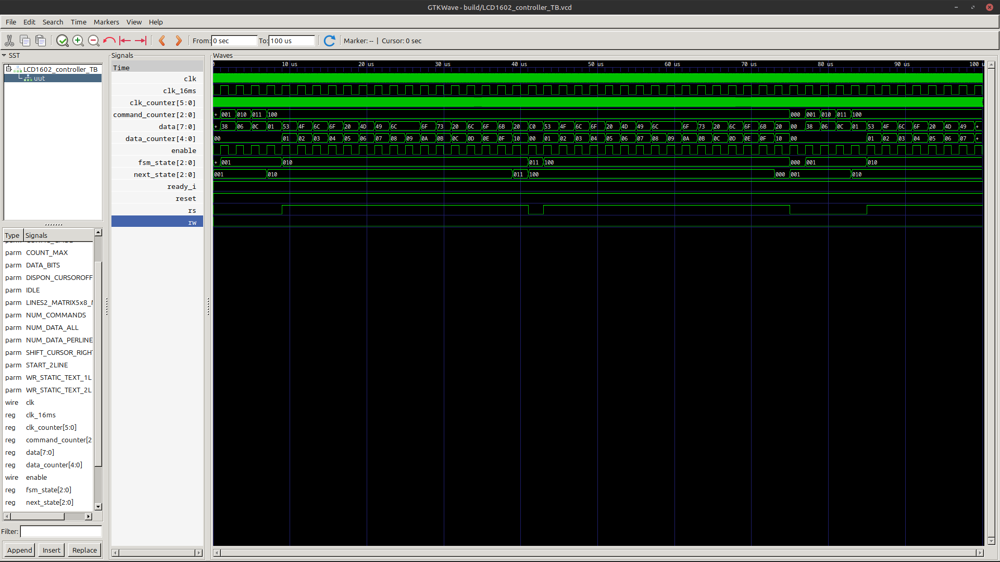
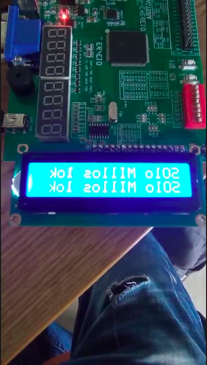

[](https://classroom.github.com/online_ide?assignment_repo_id=19878207&assignment_repo_type=AssignmentRepo)
# Lab04 - Visualización usando pantalla LCD 16x2

# Integrantes

[David Chaparro](https://github.com/DavidChaparro10)

# Informe

Indice:

1. [Diseño implementado](#diseño-implementado)
2. [Simulaciones](#simulaciones)
3. [Implementación](#implementación)
4. [Conclusiones](#conclusiones)
5. [Referencias](#referencias)

## Diseño implementado

### Descripción

En este laboratorio se implementó un sistema de visualización basado en una pantalla LCD 16x2, controlada mediante una Máquina de Estados Finitos (FSM) escrita en Verilog HDL. Esta permite visualizar texto estático y dinámico desde una tarjeta FPGA Altera Cyclone IV, usando comunicación en modo 8 bits.

El proyecto fue creado con la estructura base proporcionada por la profesora, con archivos fuente organizados para facilitar la simulación e implementación. Se inició con la implementación funcional básica dada, para luego analizar y extender el código.

#### Parámetros y sintáxis

El módulo principal del controlador utiliza una sintaxis basada en parámetros (parameter y localparam), la cual permite reutilizar valores constantes en diferentes partes del código. Algunos parámetros clave incluyen:

- ```NUM_COMMANDS = 4```: número de comandos de inicialización (en este caso 4) .

- ```NUM_DATA_ALL = 32```: cantidad total de caracteres a mostrar (16 por cada una de las 2 filas).

- ```DATA_BITS = 8```: tamaño de cada palabra de datos enviada a la LCD (en este caso 8).

- ```COUNT_MAX = 800000```: constante utilizada para temporización del pulso Enable.

Por ejemplo, ```DATA_BITS``` permite definir automáticamente el ancho de buses y registros, facilitando la escalabilidad del diseño. Esta práctica es fundamental en proyectos de hardware bien estructurados.

#### Descripción funcional

**Entradas y salidas**

- **Entradas**:
    - ```clk``` y ```reset```: reloj reinicio del sistema.

    - ```ready_i```: señal para iniciar la escritura en la LCD.

- **Salidas**:

    - ```rs```y ```rw```: señales de control (registro o dato / lectura o escritura).

    - ```enable```: pulso de habilitación.

    - ```data[7:0]```: bus de datos para la LCD.

Las salidas del módulo Verilog se conectan como entradas a la LCD. Así, todo lo que se configure desde el controlador se transmite directamente a la pantalla.

**FSM (Máquina de Estados)**

Los estados de la FSM están definidos usando ```localparam```, con nombres representativos:

```
localparam IDLE = 3'd0;
localparam CONFIG = 3'd1;
localparam WAIT = 3'd2;
localparam SEND = 3'd3;
...
```
El número de bits usados en cada estado depende del total de estados posibles (log₂(n)), lo cual se calcula de forma eficiente mediante ```$clog2```.

**Contadores y registros**

Se utilizan varios registros internos:

- ```fsm_state```: estado actual de la FSM.

- ```command_counter```, ```data_counter```: controlan el avance en las secuencias de configuración y visualización.

```clk_counter```: implementa un divisor de frecuencia, calculado automáticamente con ```$clog2(COUNT_MAX)```.

```clk_16ms```: reloj derivado.

```data```, ```rs```, ```rw```: registros de salida hacia la pantalla.

**Memoria interna**

Se implementan bancos de registros:

```
reg [DATA_BITS-1:0] static_data_mem [0:NUM_DATA_ALL-1];
reg [DATA_BITS-1:0] config_mem [0:NUM_COMMANDS-1];
```
Estos representan una memoria tipo ROM, donde:

```static_data_mem```: contiene los caracteres estáticos a mostrar (leídos desde un archivo).

```config_mem```: contiene los comandos de inicialización de la LCD.

La carga inicial se realiza con:

```
$readmemh("path_to_txt.txt", static_data_mem);
```
Este archivo debe contener 32 valores en hexadecimal que representen los caracteres ASCII a visualizar.

**Comandos de configuración**

Estos comandos provienen del datasheet de la pantalla. Algunos ejemplos:

```
localparam CLEAR_DISPLAY = 8'h01;
localparam SHIFT_CURSOR_RIGHT = 8'h06;
localparam DISPON_CURSOROFF = 8'h0C;
localparam LINES2_MATRIX5x8_MODE8bit = 8'h38;
localparam START_2LINE = 8'hC0;
```
Los cuatro primeros se usan al inicio; el último permite escribir en la segunda línea. En total, se usan 4 comandos.

### Diagramas


## Simulaciones 


<!-- (Incluir las de Digital si hicieron uso de esta herramienta, pero también deben incluir simulaciones realizadas usando un simulador HDL como por ejemplo Icarus Verilog + GTKwave) -->


## Implementación

### Configuración en Quartus

Se siguieron los siguientes pasos:

- Conexión física de la pantalla LCD al header correspondiente, asegurando el pin 1 alineado:


- Configuración de pines en el Pin Planner, incluyendo las señales de control y datos:


- Configuración especial del pin 101 (nCEO) como I/O regular:


### Resultados en la FPGA

- En la parte 1, se visualizaron correctamente los 32 caracteres definidos en el archivo [data.txt](src/data.txt):


**Nota** Se puede ver un video de la implementación en la carpeta de [Anexos](Anexos).


- En la parte 2, se preparó la arquitectura para recibir entradas dinámicas, de forma que el valor recibido pueda ser convertido a ASCII y mostrado

## Conclusiones


- La integración de memorias ROM internas, parámetros y estructuras escalables (como $clog2) permiten hacer diseños robustos y reutilizables.

- El uso de comandos y datos fue validado con simulaciones funcionales, mostrando cómo se configura y opera una LCD en modo 8 bits.


## Referencias

1. [Datasheet LCD 16x2](https://github.com/digital-electronics-UNAL/2025-1/blob/main/labs/lab04/lcd016n002bcfhet.pdf)

2. Material de clase y explicaciones de la docente.


3. [Código base del laboratorio: GitHub – Digital Electronics UNAL](https://github.com/digital-electronics-UNAL/2025-1/blob/main/labs/lab04/README.md)
